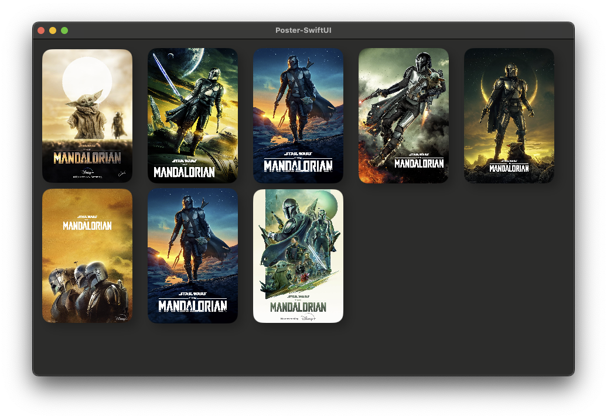
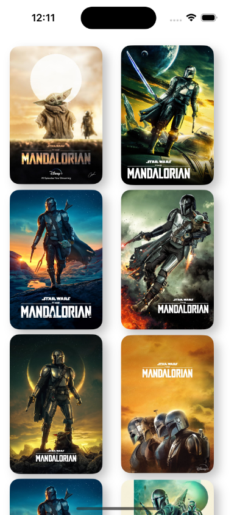

# Poster View

An experimentation in creating a "poster view" which can load images from a local source (like the bundle) or remotely from an `URL`, in SwiftUI

<table>
  <tr>
    <td></td>
    <td></td>
  </tr>
</table>
